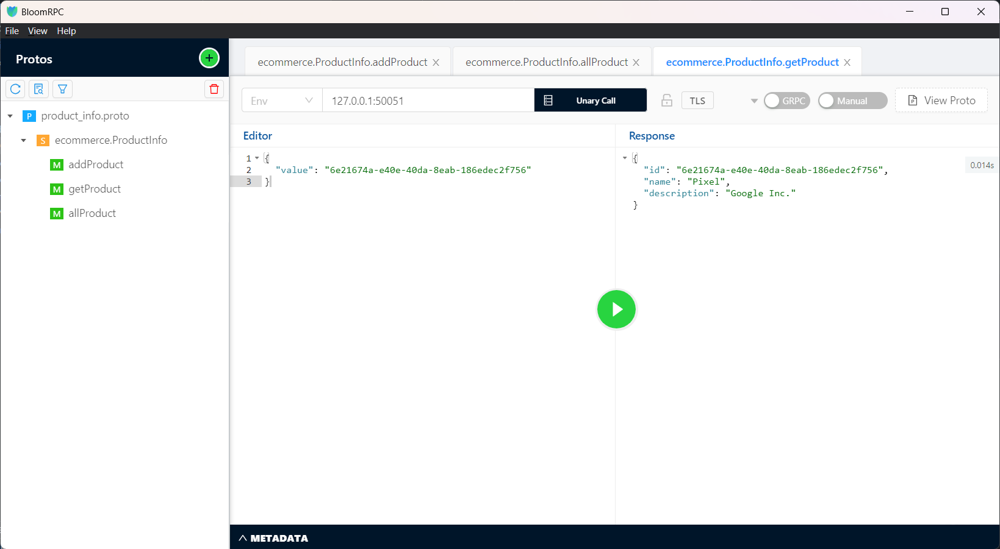
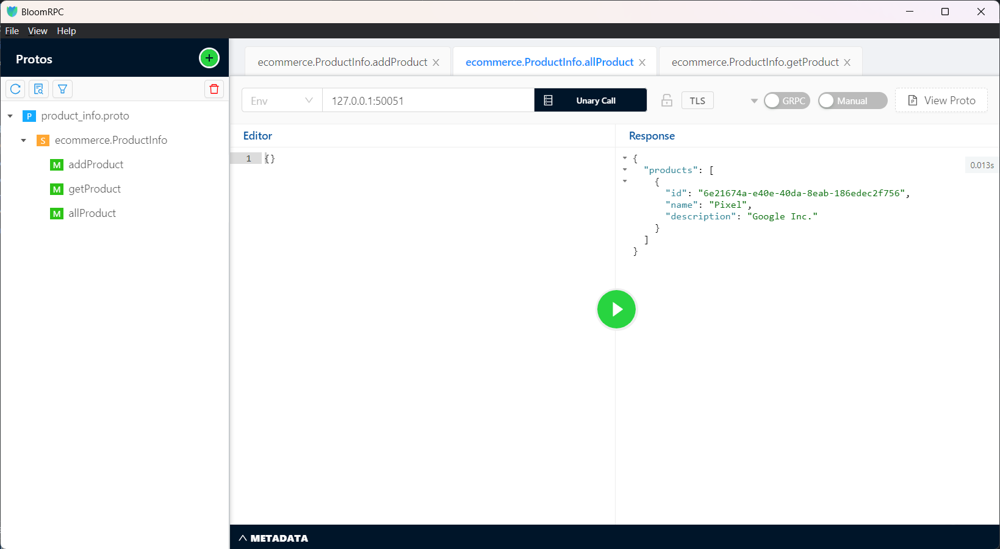

# Simple Ecommerce Product API 

### Technogies Used
- Golang
- gRPC
- Docker

### proto file
```proto
syntax = "proto3";
package ecommerce;

option go_package = "/home/aniket/go-projs/product_info/ecommerce";

service ProductInfo {
    rpc addProduct(Product) returns (ProductID);
    rpc getProduct(ProductID) returns (Product);
    rpc allProduct(Empty) returns (Products);
}

message Empty {

}

message Product {
    string id = 1;
    string name = 2;
    string description = 3;
}

message Products {
    repeated Product products = 1;
}

message ProductID {
    string value = 1;
}
```

### Project Setup Guide

1. Clone the Repo
```bash
    git clone <repo_address>
``` 

2. Build Docker Image
```bash
    docker build -t golang-proto .
``` 

3. Run Docker Image
```bash
    docker run -p 50051:50051 golang-proto
```

### Screenshots of API

I used BloomRPC for testing the APIs.





